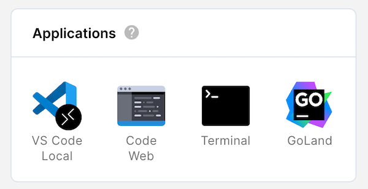
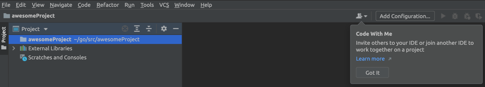
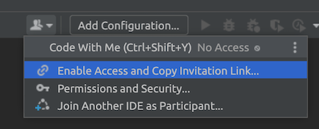
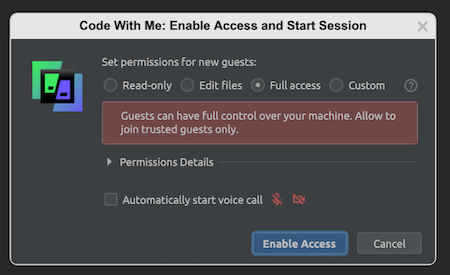
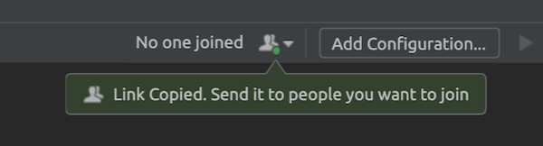
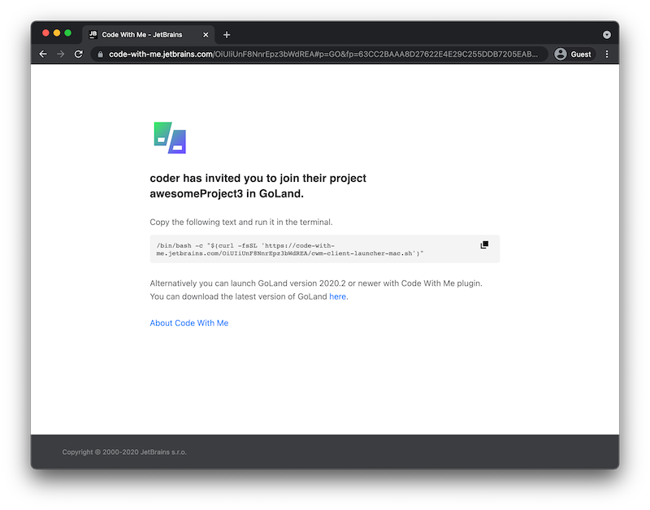
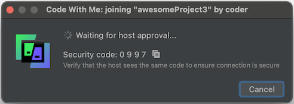
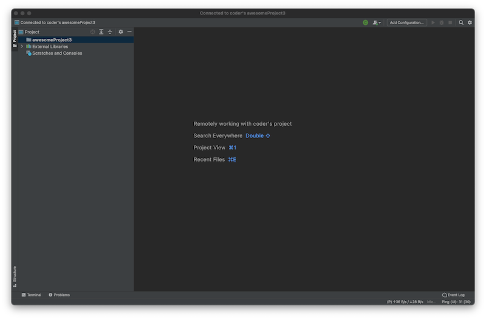

This article will show you how to set up a Code With Me session when running a
JetBrains IDE in Coder. JetBrains' [Code With
Me](https://www.jetbrains.com/code-with-me/) allows you to collaborate with
others in real-time on your project and enables pair programming.

## Prerequisites

You must have a [JetBrains IDE
installed](../admin/workspace-management/installing-jetbrains.md) onto your
[image](../images/index.md).

## Getting started

To set up a Code With Me session:

1. The host creates a session and shares the information needed to join the
   session with other participants.
1. The participants use the information provided by the host to join the session
   and request access.
1. The host accepts the participants' request to join the session created
   by the host.

### Step 1: Start and host a session

To create and host a Code With Me session:

1. Log in to Coder.

1. Under **Applications**, launch the JetBrains IDE (e.g., GoLand) of your
   choice.

   

1. Click the **Code With Me** icon at the top of your IDE.

    

1. Select **Enable Access and Copy Invitation Link...**.

   

1. Confirm and accept the Terms of Use.

1. Set the permissions for new guests to **Full access** and uncheck the
   **Automatically start voice call** feature. Click **Enable Access**.

   

1. Once you've enabled access, JetBrains copies the link you must share with
   participants to your clipboard. Send this link to those with whom you'd like
   to collaborate.

   You can recopy this link at any time by clicking the **Code With Me icon**
   and choosing **Copy Invitation Link...**.

   

### Step 2: Request to join the session

If you've received a link to join a Code With Me session as a participant:

1. Copy the Code With Me session link that you were provided, and paste it into
   your web browser. You'll be directed to a webpage with further instructions.

1. On the instructions page to which you were directed, copy the code snippet
   and run it in the terminal.

   

1. Confirm and accept the User Agreement.

1. You'll be shown a **security code**. Verify with the host of your session
   that they see the same code.

   

1. Wait for your host to accept your request to join; when they do, your
   JetBrains IDE will launch automatically.

   

### Step 3: Accept the request to the join

If you're the host of the session, you'll see a request that the other
participant wants to join your project, the permissions you've
granted to the other user, and a security code.

   

Verify that the security code you see matches the one shown to your
participants. If they do, click **Accept** to proceed.

At this point, you'll be able to share your project and work with your partner
in real-time.
