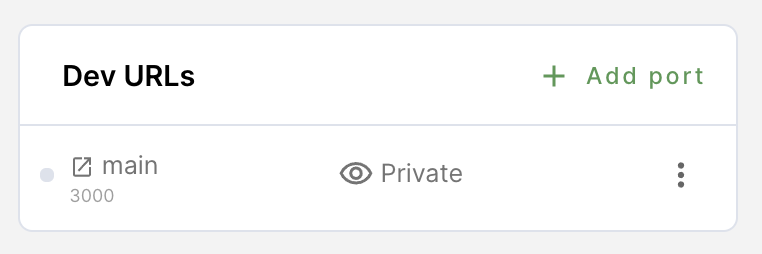
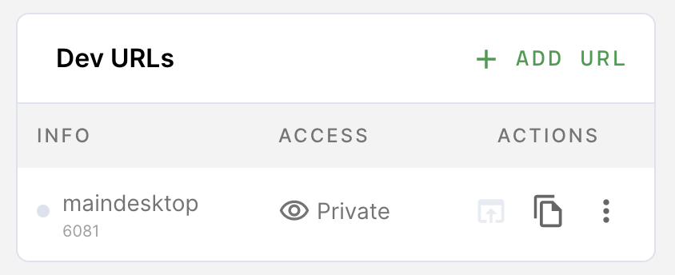

Developer (dev) URLs allow you to access the web services you're developing in
your workspace.

> You must have [dev URLs enabled](../admin/devurls.md) in your installation.

## Creating a dev URL

You can create a dev URL from the workspace overview page.

In the **Dev URLs** section, click **Add URL**. First, provide the **port**
number you want to be used and a friendly **name** for the URL (optional). Next,
indicate who can **access** the URL and the **internal server scheme** (e.g.,
whether Coder should use HTTP or HTTPS when proxying requests to the internal
server).



## Access control

You can set the access level for each dev URL:

- **Private** - Only the owner of the workspace can access the URL
- **Organization** - Anyone in the same organization as the workspace can access
  the URL
- **Authorized Users** - Anyone logged in to your Coder instance can access the
  URL
- **Public** - Anyone on the internet can access the URL

## Using dev URLs

To access a dev URL, you can click:

- The **Open in browser** icon to launch a new browser window
- The **Copy** button to copy the URL for sharing



### Direct access

There are two ways for you to construct dev URLs.

If you provided a name for the dev URL when you created it:

```text
<name>-<username>.domain
```

If you didn't provide a name for the dev URL when you created it:

```text
<port>-<workspace_name>-<username>.domain
```

For example, let's say that you've created a dev URL for port `8080`. Also:

- Username: `user`
- Domain: `acme.com`
- Workspace: `my-project`

If you didn't name your dev URL, then your URL is
`8080-my-project-user.acme.com`.

If, however, you named the dev URL `reactproject`, then your URL is
`reactproject-user.acme.com`.

If you access a dev URL that hasn't been created, Coder automatically adds it to
your dev URL list on the dashboard and sets the access level to **Private**.

## Programmatically accessing dev URLs

If you need programmatic access to authenticated dev URLs (Private,
Organization, or Authenticated Users), you can do the following:

```console
# Generate a token
coder@dev ~ coder tokens create devurl
<TOKEN>
# Curl Dev URL
coder@dev ~ curl --cookie "devurl_session=<TOKEN>" <dev-url>
```

## Access via SSH port forwarding

You can also access your server via [SSH port forwarding](ssh.md#forwarding-dev-urls).
