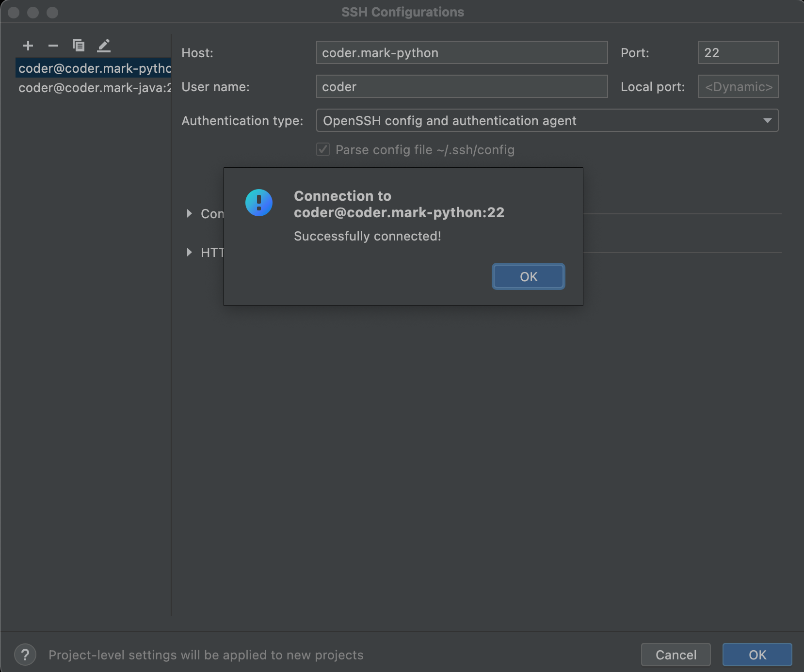
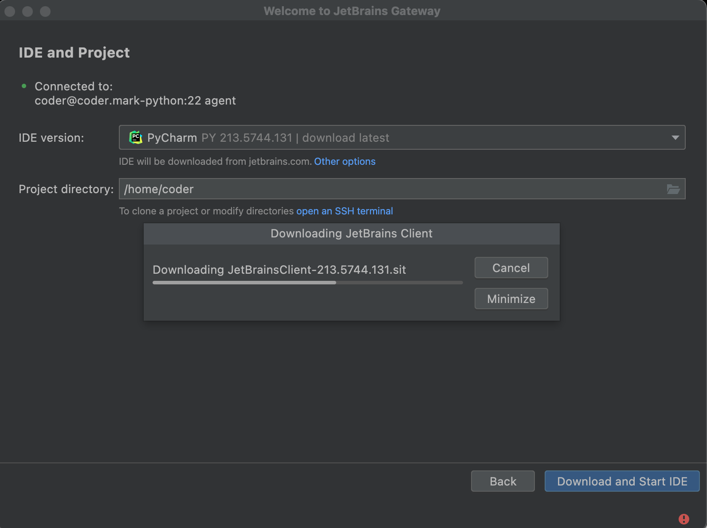
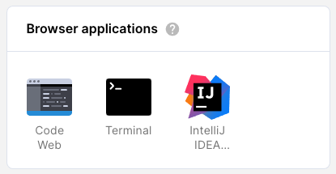

There are several primary ways you can connect an IDE to your Coder workspace:

1. [VS Code remote SSH](editors.md#vs-code-remote-ssh) with local VS Code
1. [VS Code in the browser](editors.md#vs-code-in-the-browser) with code-server
1. [JetBrains Gateway and SSH](editors.md#jetbrains-gateway-with-ssh)
1. [JetBrains in the browser](editors.md#jetbrains-ides-in-the-browser) with
   JetBrains Projector
1. [JetBrains' Code With Me](editors.md#code-with-me)
1. [RStudio](editors.md#rstudio)
1. _Any_ local editor with
   [1-way file synchronization](../cli/file-sync.md#one-way-file-sync) or
   [2-way file synchronization over SSH](../cli/file-sync.md#two-way-file-sync)

## VS Code remote SSH

Once you've [set up SSH access to Coder](./ssh.md), you can work on projects
from your local VS Code, connected to your Coder workspace for compute, etc.

1. Open VS Code locally.
1. Make sure that you've installed
   [Remote - SSH](https://marketplace.visualstudio.com/items?itemName=ms-vscode-remote.remote-ssh)
   extension
1. In VS Code's left-hand nav bar, click **Remote Explorer** and right-click on
   a workspace to connect


## VS Code in the browser

Launch VS Code in the browser from the workspaces page by clicking the _Code
Web_ icon.


> Code Web is Coder's open-source project
> [code-server](https://coder.com/docs/code-server/latest).

You can open files from your Coder workspace in VS Code in the browser aka Code Web using a terminal command.

If you would like to use the familiar `code` command, create an alias to the code-server executable.

```text
alias code="/var/tmp/coder/code-server/bin/code-server -r"
```

If you would like to just use the code-server executable, add it to your path, like in a .profile or .bashrc

```text
export PATH=$PATH:/var/tmp/coder/code-server/bin
```

If you run the command in Web Terminal, a Code Web session must already be open. If you run the command in a Code Web terminal, the file contents will appear in the editor above.

```text
code personalize.log
code-server -r personalize.log
```

## JetBrains Gateway with SSH

If your image
[includes a JetBrains IDE](../admin/workspace-management/installing-jetbrains.md)
and you've [set up SSH access to Coder](./ssh.md), you can use JetBrains Gateway
to run a local JetBrains IDE connected to your Coder workspace.

Please note that:

- Your Coder workspace must be running. Gateway needs compute resources, so
  monitor your resource usage on the Coder dashboard and adjust accordingly.
- If you use a premium JetBrains IDE (e.g., GoLand, IntelliJ IDEA Ultimate), you
  will still need a license to use it remotely with Coder.

1. [Download and install JetBrains Toolbox](https://www.jetbrains.com/toolbox-app/).
   Locate JetBrains Gateway in the Toolbox list and click **Install**.

   

1. Open JetBrains Gateway and click **Connect via SSH** within the **Run the IDE
   Remotely** section.

   

1. Click the small **gear icon** to the right of the **Connection** field, then
   the **+** button on the next screen to create a new configuration.

   

1. Enter your Coder workspace alias target in **Host** (e.g.,
   `coder.mark-python`), `22` in **Port**, `coder` in **User name**, and change
   **Authentication Type** to **OpenSSH config and authentication agent**. Leave
   the local port field blank. Click **Test Connection**.

   

1. With your created configuration in the **Connection** chosen in the drop-down
   field, click **Test Connection**, then **OK**.

   

1. Select a JetBrains IDE from the IDE version drop-down. Choose the IDE
   installed in your Coder workspace, and click the folder icon and select your
   `/home/coder` directory in your Coder workspace.

   

1. During this installation step, Gateway downloads the IDE and a JetBrains
   client. This may take a couple minutes.

   

   

   

> If your Coder deployment is configured with ECDSA ssh key algorithm, change
> the Gateway authentication type to **Key pair** and create the Coder public
> ssh key in your local `~/.ssh` directory with `ssh-keygen -y -f`:
>
> `~/.ssh/coder_enterprise | tee ~/.ssh/coder_enterprise.pub`

## JetBrains IDEs in the browser

Coder uses an open-source project called Projector, created and managed by
JetBrains, to render a JetBrains IDE in a browser.

If your image
[includes a JetBrains IDE](../admin/workspace-management/installing-jetbrains.md)
(such as IntelliJ, PyCharm, and PhpStorm), you can launch it from the dashboard.



Coder launches JetBrains IDEs in their own windows; be sure to set your browser
to allow popup windows so that you can use your IDE.

> Follow these steps to
> [start a trial or activate your paid JetBrains license](../guides/troubleshooting/activate-jetbrains-licensing.md).

### Installing JetBrains' IDEs

You install JetBrains IDEs in a Dockerfile, add the required packages to run
JetBrains in a browser, and create a symlink with one of the following names so
Coder can auto-detect the IDE and display the icon in the workspace.

Using Docker, you `docker build` the image from the Dockerfile. You then push
the image to your container registry and import the image into your Coder
deployment.

Your administrator can
[follow these steps to build the JetBrains IDE image](../admin/workspace-management/installing-jetbrains.md).

The symlink names supported by Coder are:

- `clion`
- `datagrip`
- `dataspell`
- `goland`
- `intellij-idea-ultimate`
- `intellij-idea-community`
- `phpstorm`
- `pycharm`
- `pycharm-community`
- `rider`
- `rubymine`
- `studio` (Android Studio)
- `webstorm`

## System requirements

The resources required depends on your workspace-specific requirements. We
recommend reviewing the documentation for your IDE to obtain a starting point.

### Known issues

- Window dragging behavior can misalign with mouse movements
- Popover dialogs do not always appear in the correct location
- Popup windows are missing titles and window controls
- Some theme-based plugins can cause the IDE to render incorrectly
- Some minor rendering artifacts occur during regular usage
- Keyboard shortcuts being overridden by the browser. Try
  [running JetBrains as a Progressive Web App](./pwa.md) to regain shortcuts.

## Code With Me

[JetBrains' Code With Me](https://www.jetbrains.com/code-with-me/) allows you to
collaborate with others in real-time on your project and enables pair
programming.

> You must have a
> [JetBrains IDE installed](../admin/workspace-management/installing-jetbrains.md)
> in your [image](../images/index.md) to start a Code With Me session from your
> Coder workspace. Only the workspace where the source code is being worked on
> needs JetBrains; other collaborators do _not_ need a JetBrains IDE.

### Getting started

To set up a Code With Me session:

1. The host creates a session and shares the information needed to join the
   session with other participants.
1. The participants use the information provided by the host to join the session
   and request access.
1. The host accepts the participants' request to join the session created by the
   host.

#### Step 1: Start and host a session

To create and host a Code With Me session:

1. Log in to Coder.

1. Under **Browser Applications**, launch the JetBrains IDE (e.g., IntelliJ
   PyCharm) of your choice.

   

1. Click the **Code With Me** icon at the top of your IDE.

   

1. Select **Enable Access and Copy Invitation Link...**.

   

1. Confirm and accept the Terms of Use.

1. Set the permissions for new guests to **Full access** and uncheck the
   **Automatically start voice call** feature. Click **Enable Access**.

1. Once you've enabled access, JetBrains copies the link you must share with
   participants to your clipboard. Send this link to those with whom you'd like
   to collaborate.

   You can recopy this link at any time by clicking the **Code With Me icon**
   and choosing **Copy Invitation Link...**.

   

#### Step 2: Request to join the session

If you've received a link to join a Code With Me session as a participant:

1. Copy the Code With Me session link that you were provided, and paste it into
   your web browser. You'll be directed to a webpage with further instructions.

1. On the instructions page to which you were directed, copy the code snippet
   and run it in the terminal.

   

1. Confirm and accept the User Agreement.

1. You'll be shown a **security code**. Verify with the host of your session
   that they see the same code.

   

1. Wait for your host to accept your request to join; when they do, your
   JetBrains IDE will launch automatically.

   

#### Step 3: Accept the request to the join

If you're the host of the session, you'll see a request that the other
participant wants to join your project, the permissions you've granted to the
other user, and a security code.


Verify that the security code you see matches the one shown to your
participants. If they do, click **Accept** to proceed.

At this point, you'll be able to share your project and work with your partner
in real-time.

## RStudio

Coder supports [RStudio](rstudio.com). To create a workspace that lets you use
RStudio:

1. Create a [custom image](../images/writing.md) with RStudio installed,
   `rserver` and `pgrep` in `PATH`, and RStudio configured to run on the default
   port (`8787`).

   To do this, you can refer to the sample Dockerfile below, which installs
   RStudio Server Open Source and creates a Unix user to log in with username
   `coder` and password `rstudio`.

   ```Dockerfile
   FROM ubuntu:20.04

   USER root

   # Install dependencies
   RUN apt-get update && \
   DEBIAN_FRONTEND="noninteractive" apt-get install --yes \
   bash \
   sudo \
   git \
   ssh \
   locales \
   wget \
   r-base \
   gdebi-core

   # Install RStudio
   RUN wget https://download2.rstudio.org/server/bionic/amd64/rstudio-server-1.4.1717-amd64.deb && \
   gdebi --non-interactive rstudio-server-1.4.1717-amd64.deb

   # Create coder user
   RUN useradd coder \
   --create-home \
   --shell=/bin/bash \
   --uid=1000 \
   --user-group && \
   echo "coder ALL=(ALL) NOPASSWD:ALL" >>/etc/sudoers.d/nopasswd

   # Ensure rstudio files can be written to by the coder user.
   RUN chown -R coder:coder /var/lib/rstudio-server
   RUN echo "server-pid-file=/tmp/rstudio-server.pid" >> /etc/rstudio/rserver.conf
   RUN echo "server-data-dir=/tmp/rstudio" >> /etc/rstudio/rserver.conf
   RUN echo "www-frame-origin=same" >> /etc/rstudio/rserver.conf

   # Remove the following line if you do not run Coder on https
   RUN echo "server-add-header=X-Forwarded-Proto: https" >> /etc/rstudio/rserver.conf

   # Assign password "rstudio" to coder user.
   RUN echo 'coder:rstudio' | chpasswd

   # Assign locale
   RUN locale-gen en_US.UTF-8

   # Run as coder user
   USER coder

   # Add RStudio to path
   ENV PATH /usr/lib/rstudio-server/bin:${PATH}
   ```

1. [Create a workspace](getting-started.md#2-create-a-workspace) using the image
   you created in the previous step.

1. At this point, you can go to **Applications** to launch RStudio.

   

   Sign in using the Unix user (whose username and password you defined in your
   image).

   > RStudio may take a few additional seconds to start launch after the
   > workspace is built.
   >
   > All RStudio data is stored in the home directory associated with the user
   > you sign in as, since this ensures that your data is saved if Coder shuts
   > down or rebuilds your environment.
