# Editors and IDEs

There are several primary ways you can connect an IDE to your Coder workspace:

1. [VS Code remote SSH](editors.md#vs-code-remote-ssh) with local VS Code
1. [VS Code in the browser](editors.md#vs-code-in-the-browser) with code-server
1. [JetBrains Gateway and SSH](editors.md#jetbrains-gateway-with-ssh)
1. [Jupyter Notebook](editors.md#jupyter-notebook)
1. [JupyterLab](editors.md#jupyterlab)
1. [RStudio](editors.md#rstudio)
1. _Any_ local editor with
   [1-way file synchronization](../cli/file-sync.md#one-way-file-sync) or
   [2-way file synchronization over SSH](../cli/file-sync.md#two-way-file-sync)

## VS Code remote SSH

Once you've [set up SSH access to Coder](./ssh.md), you can work on projects
from your local VS Code, connected to your Coder workspace for compute, etc.

1. Open VS Code locally.
1. Make sure that you've installed
   [Remote - SSH](https://marketplace.visualstudio.com/items?itemName=ms-vscode-remote.remote-ssh)
   extension
1. In VS Code's left-hand nav bar, click **Remote Explorer** and right-click on
   a workspace to connect

> If Coder is deployed air-gapped (no Internet), you need to configure your VS
> Code's [setting](https://code.visualstudio.com/docs/getstarted/settings) with
> `remote.SSH.allowLocalServerDownload` enabled so the extension will install
> the VS Code Server on the client first and then copy it over to the Coder
> workspace via SCP.
>
> For further troubleshooting steps, see
> [Troubleshooting hanging or failing connections](https://code.visualstudio.com/docs/remote/troubleshooting#_troubleshooting-hanging-or-failing-connections)


## VS Code in the browser

Launch VS Code in the browser from the workspaces page by clicking the _Code
Web_ icon.

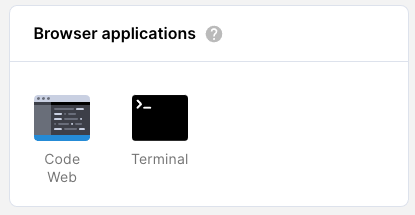

> Code Web is Coder's open-source project
> [code-server](https://coder.com/docs/code-server/latest).

### Opening files via the terminal

You can open files from your Coder workspace in VS Code via the terminal. We
recommend creating an alias to the underlying code-server executable so that you
can use the command `code` for this process:

```console
alias code="/var/tmp/coder/code-server/bin/code-server -r"
```

Then, to open a file (e.g., `personalize.log`):

```console
code personalize.log
```

Alternatively, if you would like to use just the code-server executable, add it
to your `PATH`:

```console
export PATH=$PATH:/var/tmp/coder/code-server/bin
```

Then, to open a file (e.g., `personalize.log`):

```text
code-server -r personalize.log
```

> If you're using Coder's web terminal, make sure that you've opened a Code Web
> session. If, however, you're using the web IDE's terminal, the file contents
> will appear in the IDE.

## JetBrains Gateway with SSH

[Gateway](https://www.jetbrains.com/remote-development/gateway/) is JetBrains' remote development solution. [JetBrains has suspended](https://lp.jetbrains.com/projector/) Projector (the browser-based option) therefore Coder no longer provides examples or support.

> By default, Gateway will download the IDE from jetbrains.com into the Coder
> workspace during the setup. If you are air-gapped or want to leverage a
> JetBrains IDE in your workspace for faster setup, you can point to an
> already-installed JetBrains IDE. See the configuration at the end of this
> Gateway section.

Requirements:

- SSH access to Coder must [already be configured](./ssh.md)
- Your Coder workspace must be running. Gateway needs compute resources, so
  monitor your resource usage on the Coder dashboard and adjust accordingly.
- If you use a premium JetBrains IDE (e.g., GoLand, IntelliJ IDEA Ultimate), you
  will still need a license to use it remotely with Coder.

1. [Download and install JetBrains Toolbox](https://www.jetbrains.com/toolbox-app/).
   Locate JetBrains Gateway in the Toolbox list and click **Install**.

   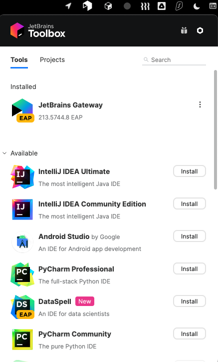

1. Open JetBrains Gateway and click **Connect via SSH** within the **Run the IDE
   Remotely** section.

   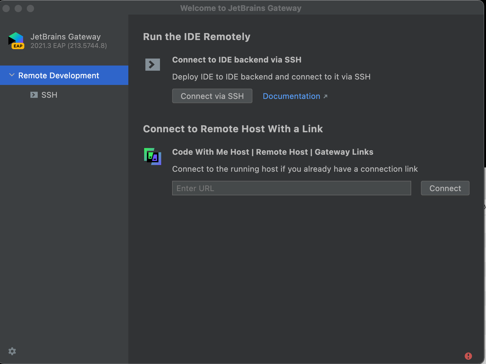

1. Click the small **gear icon** to the right of the **Connection** field, then
   the **+** button on the next screen to create a new configuration.

   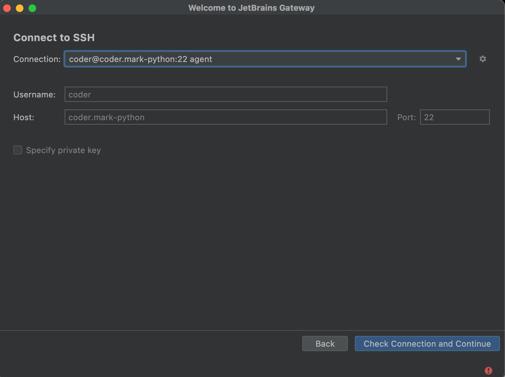

1. Enter your Coder workspace host name in **Host** (e.g.,
   `coder.mark-intellij`), `22` in **Port**, `coder` in **User name**, and
   change **Authentication Type** to **OpenSSH config and authentication
   agent**. You can find the workspace host names in `~/.ssh/config`. Leave the
   local port field blank. Click **Test Connection**.

   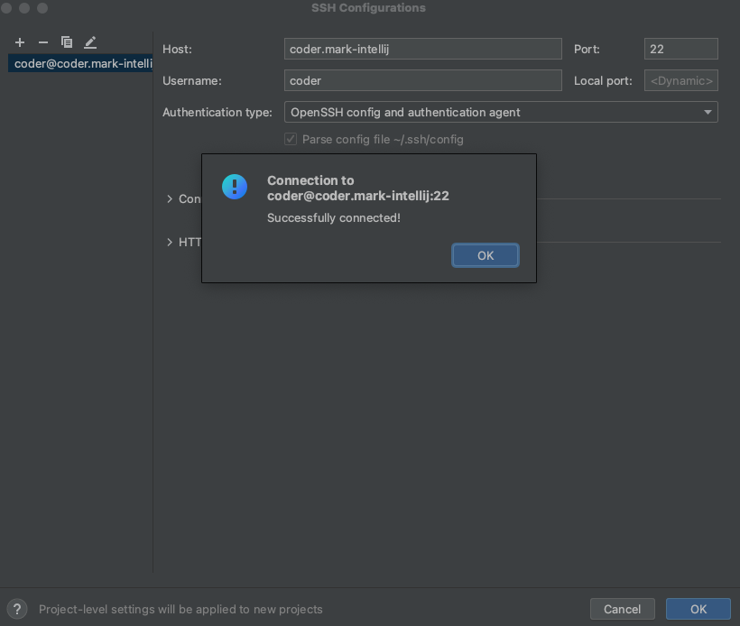

1. Choose your new connection from the drop-down and click Check Connection and
   Continue

   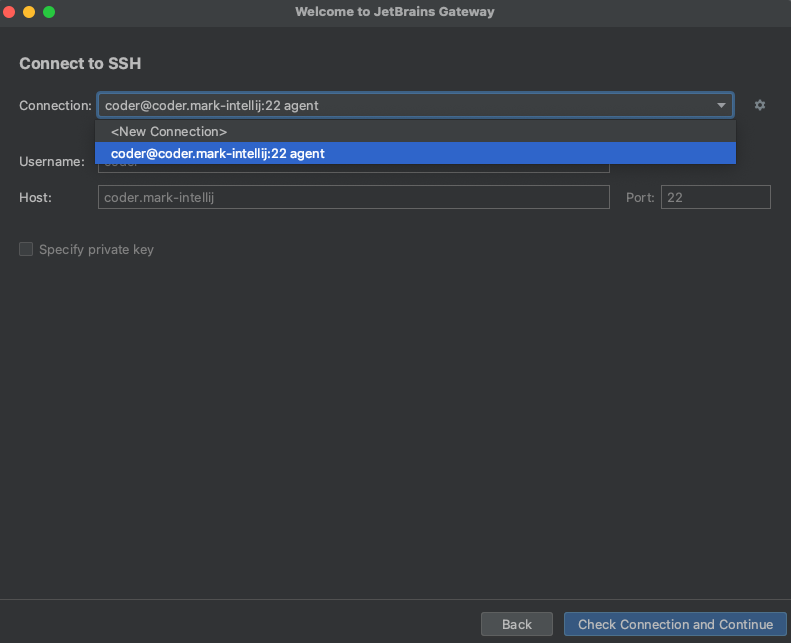

1. The default behavior is to select a JetBrains IDE from the IDE version
   drop-down and download it from jetbrain.com. Choose the IDE installed in your
   Coder workspace, and click the folder icon and select your `/home/coder`
   directory in your Coder workspace.

   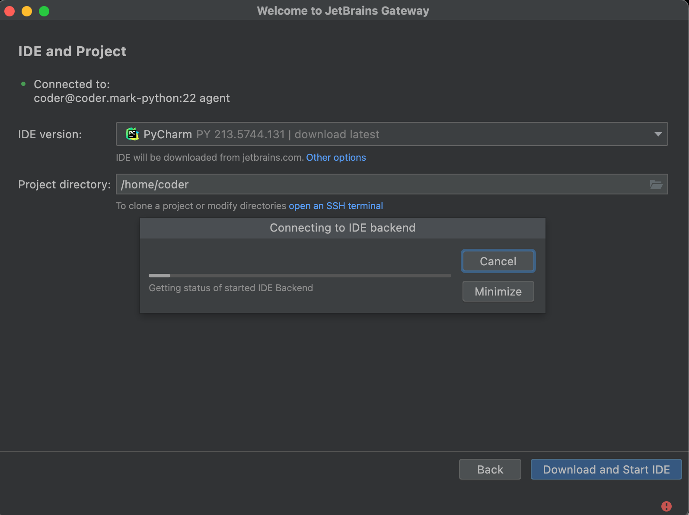

   If you ran `remote-dev-server.sh` (see note below) before starting the config
   setup, JetBrains will detect your already installed IDE in the drop-down.

   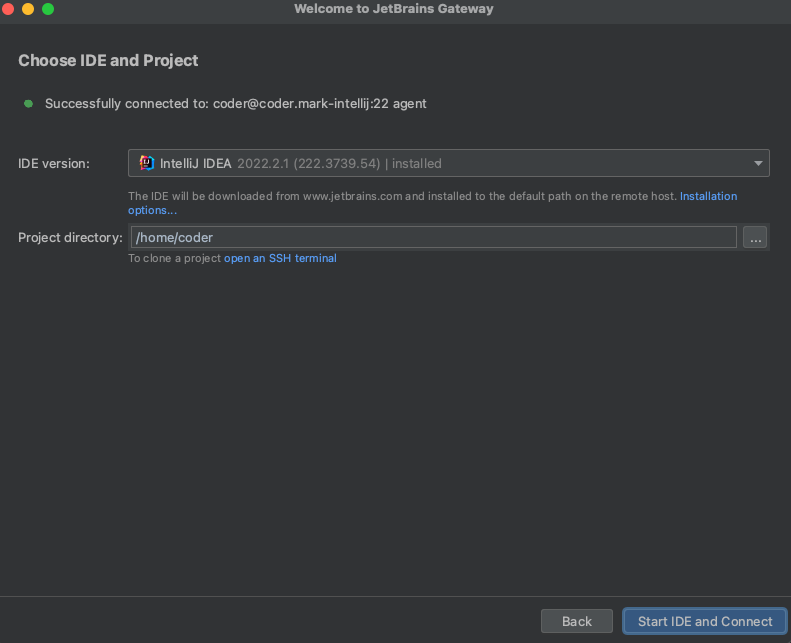

1. Gateway will open the JetBrains client connected to the remotely installed
   IDE.

   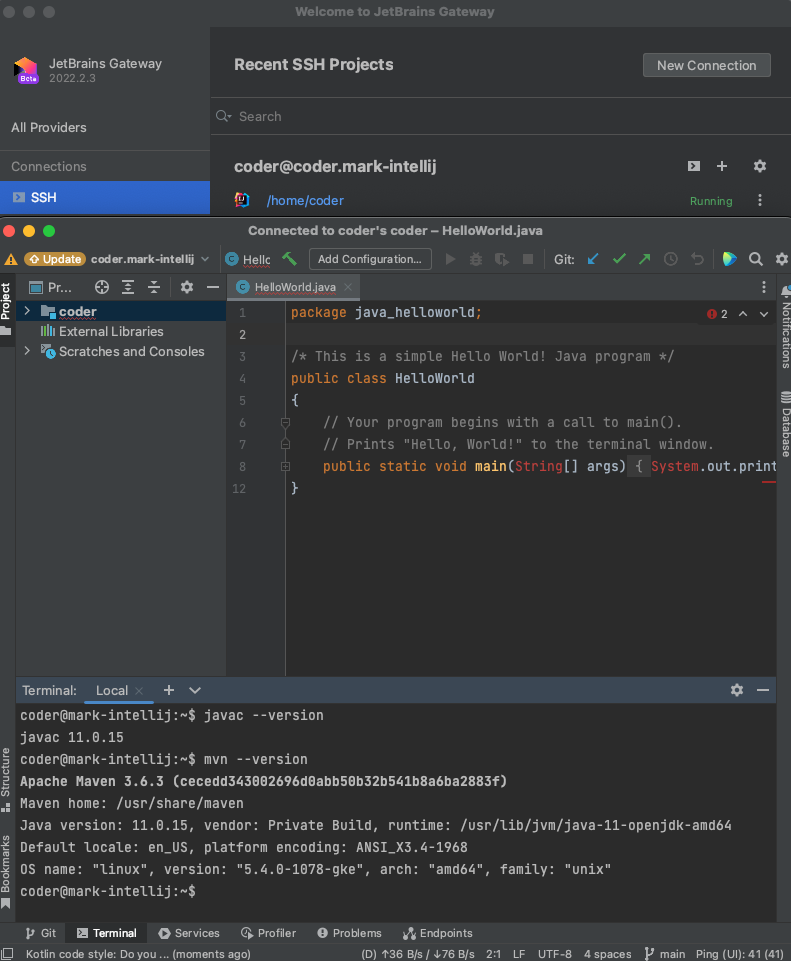

### Using an existing JetBrains installation in the workspace

If you would like to use an existing JetBrains IDE in a Coder workspace (or you
are air-gapped, and cannot reach jetbrains.com), run the following script in the
JetBrains IDE directory to point the default Gateway directory to the IDE
directory. This step must be done before configuring Gateway.

```sh
cd /opt/idea/bin
./remote-dev-server.sh registerBackendLocationForGateway
```

[Here is the JetBrains article](https://www.jetbrains.com/help/idea/remote-development-troubleshooting.html#setup:~:text=Can%20I%20point%20Remote%20Development%20to%20an%20existing%20IDE%20on%20my%20remote%20server%3F%20Is%20it%20possible%20to%20install%20IDE%20manually%3F)
explaining this IDE specification.

### Alternative SSH key algorithms and Gateway

If your Coder deployment is configured with ECDSA ssh key algorithm, change the
Gateway authentication type to **Key pair** and create the Coder public ssh key
in your local `~/.ssh` directory with `ssh-keygen -y -f`:

```sh
~/.ssh/coder_enterprise | tee ~/.ssh/coder_enterprise.pub
```

### Support & troubleshooting

[This article](https://www.jetbrains.com/help/idea/remote-development-troubleshooting.html#setup)
outlines troubleshooting steps with Gateway. JetBrains product support including
their Issue Trackers [are here.](https://www.jetbrains.com/support/)


## Jupyter Notebook

Jupyter Notebook is the original web IDE for creating Notebooks used in data
science, machine learning and analytics projects. By default, any Coder
workspace with the Jupyter project installed (in `/usr/local/bin/jupyter`) will
render the icon to launch Jupyter Notebook.

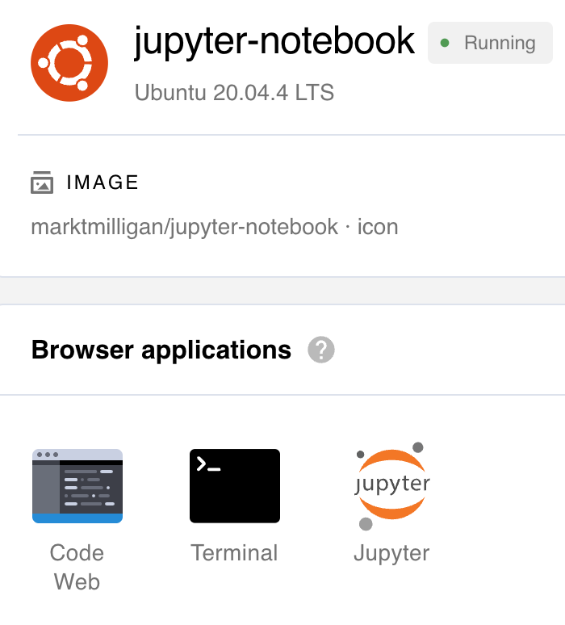

To use Jupyter Notebook in a Coder workspace, build a Dockerfile with Jupyter
project installed as shown below:

```Dockerfile
# Dockerfile to install Jupyter Notebook
FROM codercom/enterprise-base:ubuntu

USER root

RUN pip3 install jupyter notebook

USER coder
```

## JupyterLab

JupyterLab is the next-generation web-based IDE for data science and Python
using documents called Notebooks.

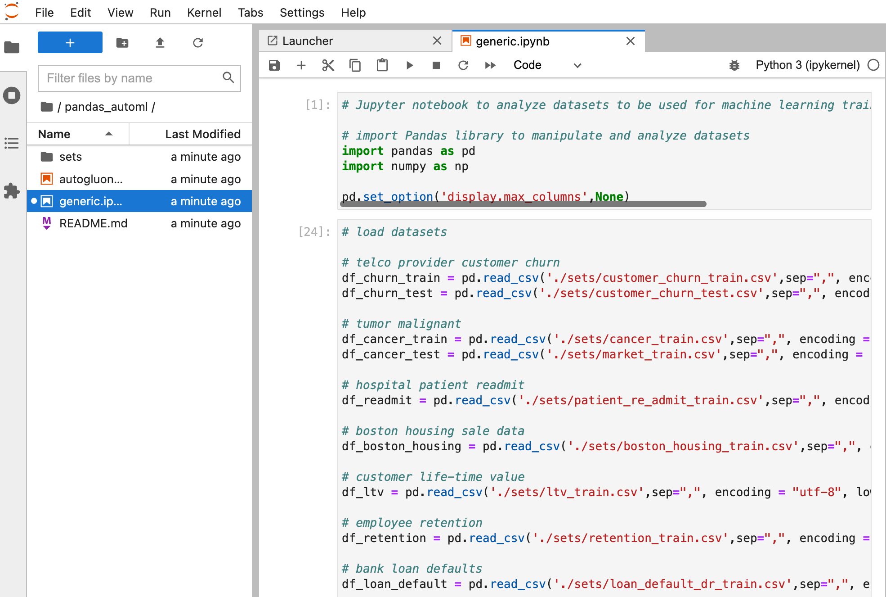

There are three methods to install and access JupyterLab in Coder. All require
JupyterLab to be installed in the Dockerfile via `pip3 install jupyterlab`.

The first method renames the `jupyter` binary and copies a new `jupyter` that
adjusts the arguments passed to the `jupyter` binary to tell Coder to launch
JupyterLab instead of Notebook.

```Dockerfile
FROM codercom/enterprise-base:ubuntu

USER root

RUN pip3 install jupyterlab
RUN pip3 install jupyter notebook

RUN mv /usr/local/bin/jupyter /usr/local/bin/jupyter.py

COPY jupyter /usr/local/bin/jupyter

RUN chmod +x jupyter

USER coder
```

Below is an example `jupyter` script with the lab arguments. This file must be
located in the same directory as the Dockerfile to be copied during
`docker build`

```sh
#!/bin/bash
# Replace all "NotebookApp" settings with ServerApp settings.
args=${@//LabApp/"ServerApp"}
# Replace 'notebook' with 'lab' to launch juypter lab
args=${args/notebook/"lab"}

jupyter.py ${args}
```

The second method to run JupyterLab is with a dev URL and launching JupyterLab
via `supervisord` in the `configure` script. The benefit of this approach is it
is completely independent of Coder's IDE launching mechanism and relies only on
a generic dev URL.

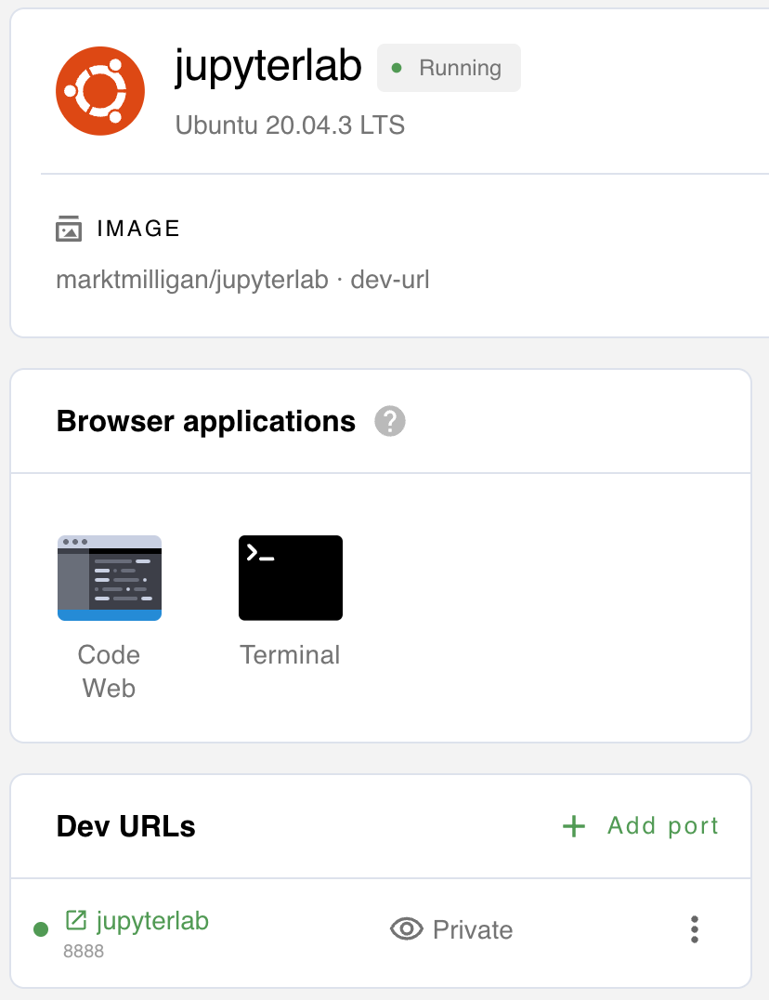

```Dockerfile
FROM codercom/enterprise-base:ubuntu

USER root

RUN pip3 install jupyterlab
RUN pip3 install jupyter notebook

# configure script to create a dev URL and launch JupyterLab
COPY ["configure", "/coder/configure"]
RUN chmod +x /coder/configure

# install supervisord
RUN apt-get update && apt-get install -y supervisor
RUN mkdir -p /var/log/supervisor
COPY supervisord.conf /etc/supervisor/conf.d/supervisord.conf

# change back to the coder user
USER coder
```

The `configure` script installs `supervisord`

```sh
#!/bin/bash

echo 'create dev URL for JupyterLab'
coder urls create $CODER_WORKSPACE_NAME 8888 --name jupyterlab

echo 'start supervisord and JupyterLab'
sudo /usr/bin/supervisord
```

The `supervisord.conf` launches JupyterLab. This file must be located in the
same directory as the Dockerfile to be copied during `docker build`

```sh
[supervisord]
nodaemon=false
environment=HOME=/home/coder

[program:jupyterlab]
command=/usr/local/bin/jupyter lab --ip='*' --NotebookApp.token='' --NotebookApp.password=''
user=coder
directory=/home/coder
```

The third method to access JupyterLab is locally using the SSH port forward
command: `ssh -L 8888:localhost:8888 coder.jupyterlab`. Alternatively, you can
use the Coder CLI to port forward using: `coder tunnel jupyterlab 8888 8888`.
Now, open a local browser and navigate to `https://localhost:8888`.

## RStudio

Coder supports [RStudio](rstudio.com). To create a workspace that lets you use
RStudio:

1. Create a [custom image](../images/writing.md) with RStudio installed,
   `rserver` in `PATH`.

   To do this, you can refer to the sample Dockerfile below, which installs
   RStudio Server Open Source to log in with username `coder` and password
   `rstudio`.

   > This Dockerfile approach works now with latest versions of RStudio
   > including 2022-2-1.

   ```Dockerfile
   FROM codercom/enterprise-base:ubuntu

   USER root

   # Install dependencies
   RUN apt-get update && \
   DEBIAN_FRONTEND="noninteractive" apt-get install --yes \
   r-base \
   gdebi-core

   # Install RStudio
   RUN wget https://download2.rstudio.org/server/bionic/amd64/rstudio-server-2022.02.1-461-amd64.deb && \
   gdebi --non-interactive rstudio-server-2022.02.1-461-amd64.deb

   # Ensure rstudio files can be written to by the coder user.
   RUN chown -R coder:coder /var/lib/rstudio-server
   RUN echo "server-pid-file=/tmp/rstudio-server.pid" >> /etc/rstudio/rserver.conf
   RUN echo "server-data-dir=/tmp/rstudio" >> /etc/rstudio/rserver.conf
   RUN echo "www-frame-origin=same" >> /etc/rstudio/rserver.conf
   RUN echo "server-user=coder" >> /etc/rstudio/rserver.conf

   # Remove the following line if you do not run Coder on https
   RUN echo "server-add-header=X-Forwarded-Proto: https" >> /etc/rstudio/rserver.conf

   # Assign password "rstudio" to coder user.
   RUN echo 'coder:rstudio' | chpasswd

   # Assign locale
   RUN locale-gen en_US.UTF-8

   # Run as coder user
   USER coder

   # Add RStudio to path
   ENV PATH /usr/lib/rstudio-server/bin:${PATH}
   ```

1. [Create a workspace](getting-started.md#2-create-a-workspace) using the image
   you created in the previous step.

1. At this point, you can go to **Applications** to launch RStudio.

   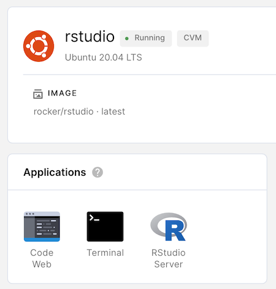

   Coder auto-signs in using the Unix user (whose username and password you
   defined in your custom image above).

   > RStudio may take a few additional seconds to start launch after the
   > workspace is built.
   >
   > All RStudio data is stored in the home directory associated with the user
   > you sign in as, since this ensures that your data is saved if Coder shuts
   > down or rebuilds your environment.

## Logging

You can find your IDE logs in the following places:

- For code-server: `~/.local/share/code-server/logs/`
- For JetBrains IDEs: `.cache/JetBrains/<JetBrains-IDE>/log/<IDE>.log`
