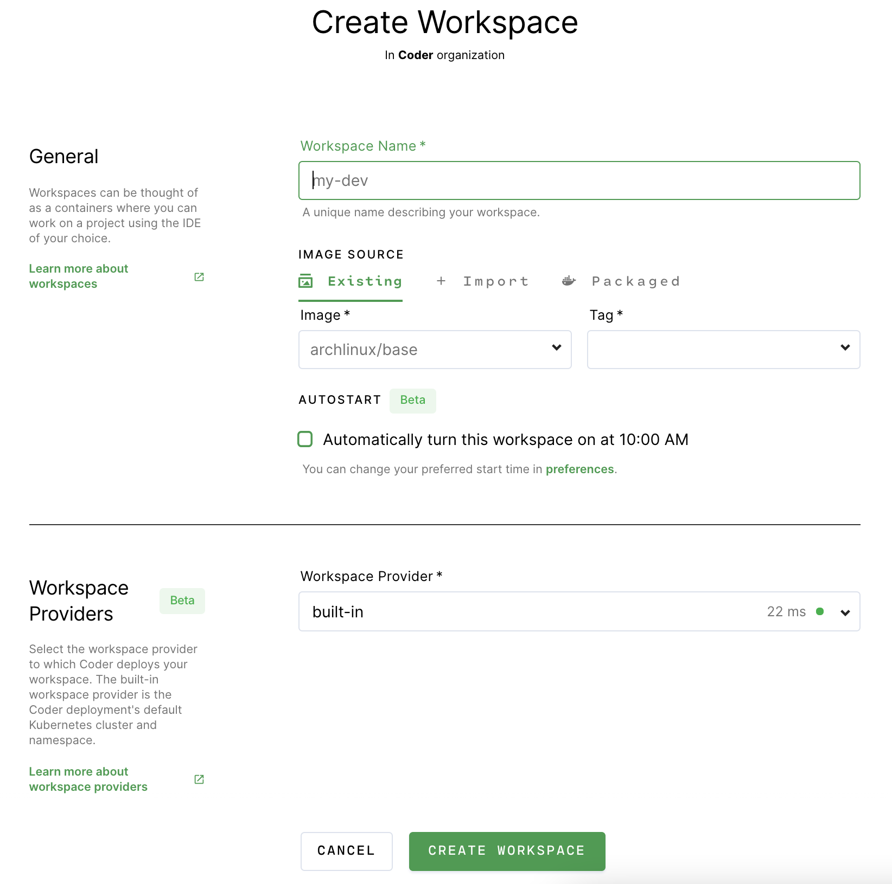

## 1. Import an image

Ensure you've [imported an image](../images/importing.md) for your
[workspace](index.md) to use.

## 2. Create a workspace

If this is your first time using Coder, you'll see a **Create Workspace** button
in the middle of your screen; otherwise, you'll see a list of your existing
workspaces. Click the **New Environment** button and choose **Custom
Workspace**.

> To learn more about creating an environment from templates, see
> [Workspaces as code](workspaces-as-code/index.md).

1. Enter a friendly name for your workspace, and choose an
   [image](../images/index.md) to use.

1. Set the [parameters](workspace-params.md) for your workspace.

1. Click **Create** to proceed.

Coder redirects you to an overview page for your workspace during the build
process. Learn more about the workspace
[creation parameters](./workspace-params.md).

Your workspace persists in the home directory, updates to new versions of the
image, and runs custom configuration on startup. Learn about the
[workspace lifecycle](lifecycle.md).

### Advanced

Coder provides advanced settings that allow you to customize your workspace. By
default, runs your workspace as a [Container-based virtual machine](cvms.md),
though you can disable CVMs at this point. You can also specify the resources
Coder should allocate.

> By default, Coder allocates resources (CPU Cores, Memory, and Disk Space)
> based on the parent image.
>
> Coder displays a warning if you choose your resource settings and they're less
> than the image-recommended default, but you can still create the workspace.

## 3. Start Coding

Once you've created a workspace, it's time to hop in. Read more about how to
[connect your favorite editor or IDE](./editors.md) with your new workspace!

> [Integrate with Git](./personalization#git-integration) to have your SSH key
> injected automatically into Workspaces.
