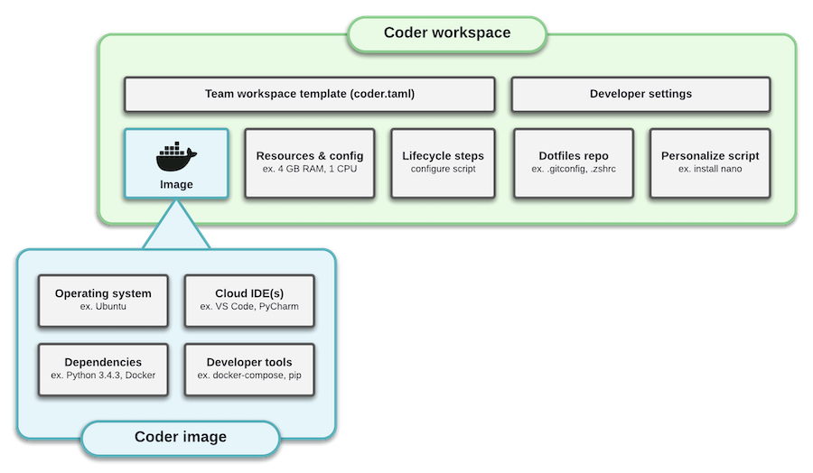

Workspaces contain the dependencies, IDEs, and configuration information needed
for your projects. Coder creates workspaces using a
[shared container image](../images/index.md), which improves their
reproducibility.

## In this section

<children></children>
