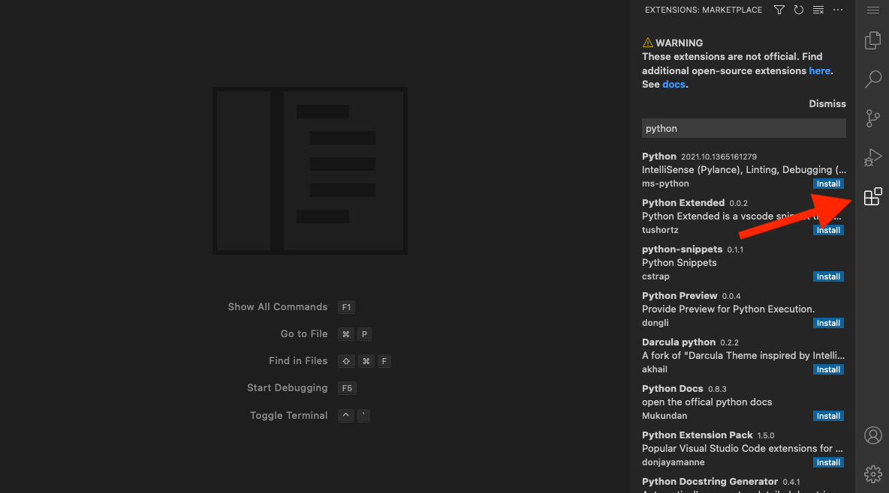
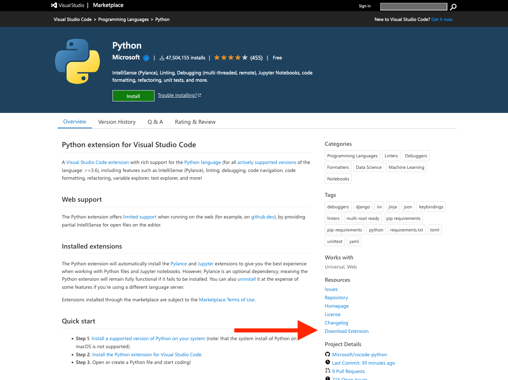
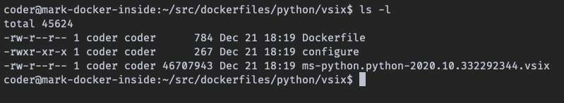
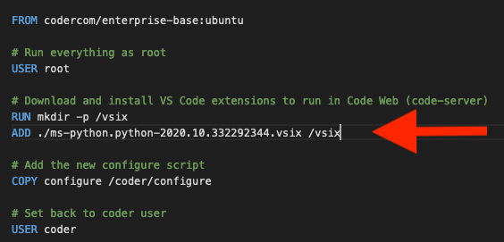
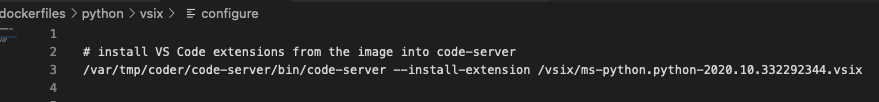
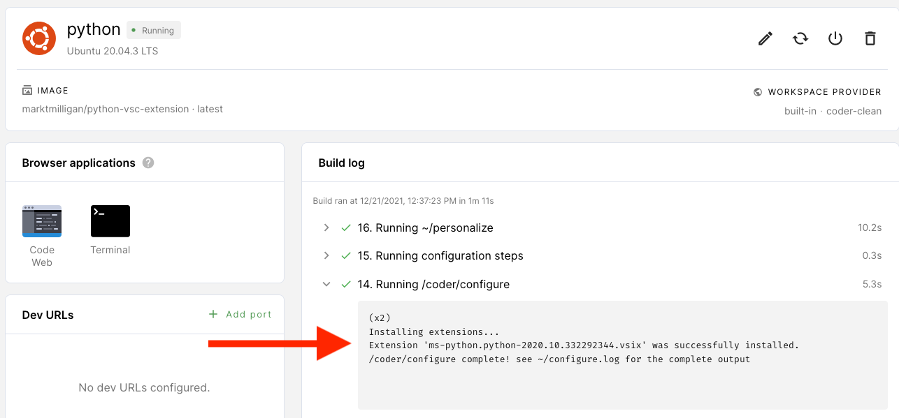
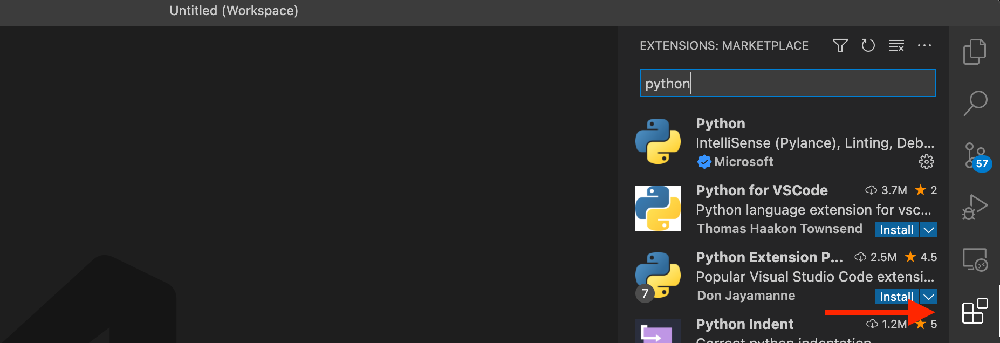

# VS Code extensions

This article will show you the ways to add VS Code extensions and use them with
a Coder workspace:

1. Using the
   [public extensions marketplaces](vs-code-extensions.md#using-the-public-extensions-marketplaces)
   with Code Web (code-server)
1. Adding
   [extensions to custom images](vs-code-extensions.md#adding-extensions-to-custom-images)
1. Installing extensions
   [using its `vsix` file at the command line](vs-code-extensions.md#installing-extensions-using-its-vsix-file-at-the-command-line)
1. Installing extensions
   [from a marketplace using the command line](vs-code-extensions.md#installing-from-a-marketplace-at-the-command-line)
1. Using a
   [local VS Code instance with SSH](vs-code-extensions.md#using-a-local-vs-code-instance-with-ssh)

## Using the public extensions marketplaces

You can manually add an extension while you're working in the Code Web IDE. The
extensions can be from Coder's public marketplace, Eclipse Open VSX's public
marketplace, or the Eclipse Open VSX _local_ marketplace.



Site managers can
[configure the specific marketplace to use](../admin/workspace-management/extensions.md#the-extension-marketplace).

> Code Web (code-server) cannot legally connect to Microsoft's public
> marketplace.

## Adding extensions to custom images

You can add extensions to a custom image and install them either through Code
Web or using the workspace's terminal.

1. Download the extension(s) from the Microsoft public marketplace.

   

1. Add the `vsix` extension files to the same folder as your Dockerfile.

   

1. In the Dockerfile, add instructions to make a folder and to copy the `vsix`
   files into the newly created folder.

   

1. Add a `configure` script to the folder with your Dockerfile, and run
   code-server to install the extension (be sure to update the filename below):

   ```console
    /var/tmp/coder/code-server/bin/code-server --install-extension /vsix/YOUR_EXTENSION.vsix
   ```

   

1. Build the custom image, and upload to the Docker registry you've connected to
   Coder.

1. [Import the custom image](../images/importing.md) into Coder.

1. Create a workspace using the custom image.

   

You will now have access to the extension in your workspace.

## Installing extensions using its `vsix` file at the command line

Using the workspace's terminal or the terminal available inside Code Web (code
server), you can install an extension whose files you've downloaded from a
marketplace:

```text
/var/tmp/coder/code-server/bin/code-server --install-extension /vsix/ms-python.python-2020.10.332292344.vsix
```

> You can also run these commands within a
> [template](./workspace-templates/templates.md),
> [configure script](../images/configure.md) or
> [personalize script](./personalization.md#personalize).

## Installing from a marketplace at the command line

Using the workspace's terminal or the terminal available inside Code Web (code
server), run the following to install an extension (be sure to update the
snippets with the name of the extension you want to install):

```text
SERVICE_URL=https://extensions.coder.com/api ITEM_URL=https://extensions.coder.com/item /var/tmp/coder/code-server/bin/code-server --install-extension ms-python.python
```

Alternatively, you can install an extension from Open VSX's public marketplace:

```text
SERVICE_URL=https://open-vsx.org/vscode/gallery ITEM_URL=https://open-vsx.org/vscode/item /var/tmp/coder/code-server/bin/code-server --install-extension ms-python.python
```

## Using a local VS Code instance with SSH

You use a local instance of the VS Code IDE and
[configure with Coder via SSH](./editors.md#vs-code-remote-ssh) to add
extensions from Microsoft's extension marketplace.


