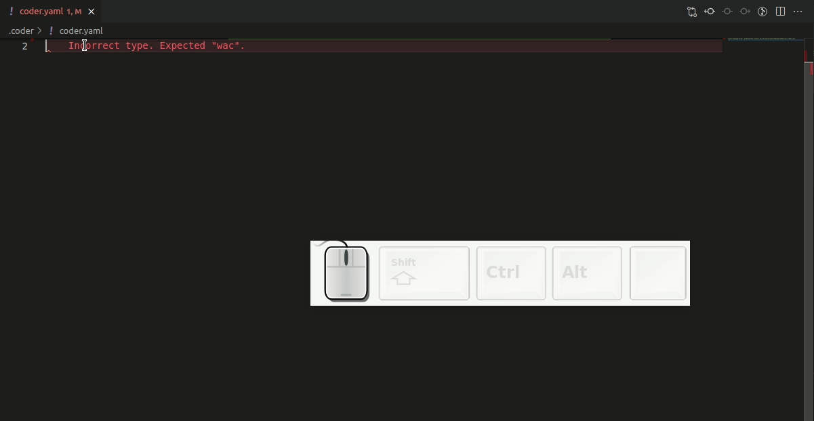

Coder provides a [JSON Schema](https://json-schema.org/) for workspace templates
that enables code completion and syntax checking.

## Requirements

You must have the [YAML extension by Red
Hat](https://marketplace.visualstudio.com/items?itemName=redhat.vscode-yaml)
installed to use this feature.

## How to use

Create a file called `coder.yaml`, and add the following to the top (be sure to
replace the `<deployment_url>` placeholder with your Coder deployment URL):

```yaml
# yaml-language-server: $schema=https://<deployment_url>/api/private/template/schemas/wac.schema.json

# Write your YAML config here
```

At this point, you can use the code completion and syntax checking features.

## Keyboard shortcuts

Some keyboard shortcuts you may find helpful include:

- Document outlining (<kbd>Ctrl</kbd> + <kbd>Shift</kbd> + <kbd>O</kbd>)
- Auto completion (<kbd>Ctrl</kbd> + <kbd>Space</kbd>)

See the [YAML extension by Red Hat
docs](https://marketplace.visualstudio.com/items?itemName=redhat.vscode-yaml)
for additional shortcuts.


